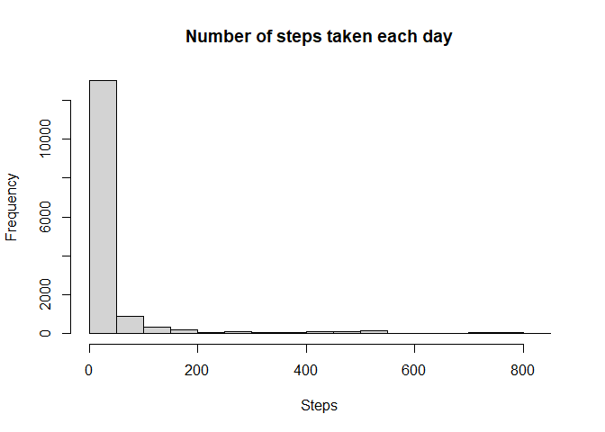
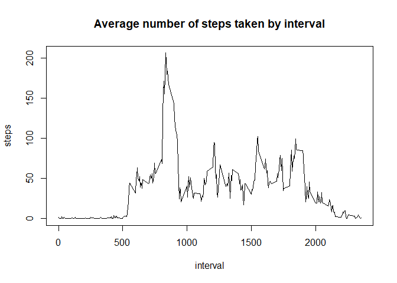
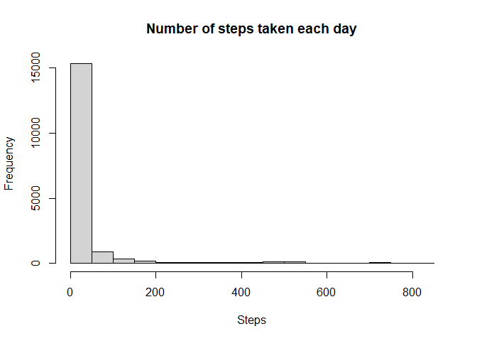
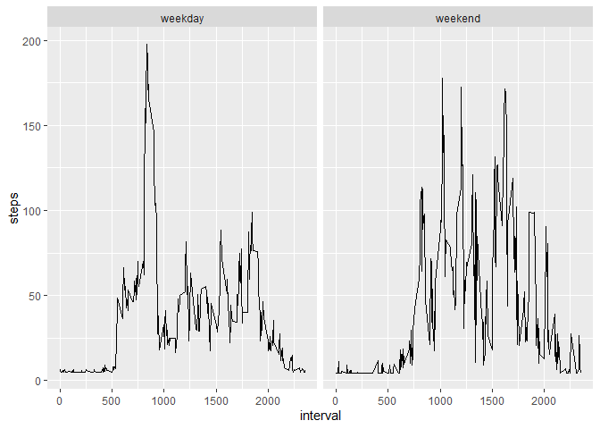

## Setup

```r
library(dplyr)
```

```
## 
## Attaching package: 'dplyr'
```

```
## The following objects are masked from 'package:stats':
## 
##     filter, lag
```

```
## The following objects are masked from 'package:base':
## 
##     intersect, setdiff, setequal, union
```

```r
library(ggplot2)
```

## Loading and preprocessing the data

```r
raw_data <- read.csv("activity/activity.csv", header=TRUE)
```

Transform date column to date format.

```r
new_data <- with(raw_data, data.frame(steps=steps, date=strptime(date, format = "%Y-%m-%d"), interval=interval))
```


## What is mean total number of steps taken per day?
Total number of steps taken per day

```r
new_data %>% group_by(date=as.factor(date)) %>% summarise(total_steps=sum(steps,na.rm=TRUE))
```

```
## `summarise()` ungrouping output (override with `.groups` argument)
```

```
## # A tibble: 61 x 2
##    date       total_steps
##    <fct>            <int>
##  1 2012-10-01           0
##  2 2012-10-02         126
##  3 2012-10-03       11352
##  4 2012-10-04       12116
##  5 2012-10-05       13294
##  6 2012-10-06       15420
##  7 2012-10-07       11015
##  8 2012-10-08           0
##  9 2012-10-09       12811
## 10 2012-10-10        9900
## # ... with 51 more rows
```

Histogram of the total number of steps taken each day

```r
hist(new_data$steps,main="Number of steps taken each day", xlab = "Steps")
```

<!-- -->

Mean and median of the total number of steps taken per day.

```r
new_data %>% group_by(date=as.factor(date)) %>% summarise(total_steps=sum(steps,na.rm=T)) %>%
    summarise(mean=mean(total_steps),median=median(total_steps))
```

```
## `summarise()` ungrouping output (override with `.groups` argument)
```

```
## # A tibble: 1 x 2
##    mean median
##   <dbl>  <int>
## 1 9354.  10395
```


## What is the average daily activity pattern?
Time series plot of the 5-minute interval and the average number of steps taken, averaged across all days.

```r
step_inter <- aggregate(steps ~ interval, data=new_data,FUN=mean)
with(step_inter, plot(x=interval, y=steps,type="l", main = "Average number of steps taken by interval"))
```

<!-- -->

The 5-minute interval that contains the maximum
number of steps across is the one with id 835.


```r
subset(step_inter, steps==max(step_inter$steps))
```

```
##     interval    steps
## 104      835 206.1698
```


## Imputing missing values
There were **2304** missing values in the dataset.

```r
nrow(raw_data[!complete.cases(raw_data),])
```

```
## [1] 2304
```

Filling in all missing values in the dataset with the **average** steps.

```r
# Created new dataset
data_clean <- mutate(new_data, steps=ifelse(!is.na(steps), steps, mean(steps,na.rm=TRUE)))
```

**Histogram of the total number of steps taken each day**  
The frequency of the number of steps close to 600 increased when NAs were filled in.

```r
hist(data_clean$steps,main="Number of steps taken each day", xlab = "Steps")
```

<!-- -->

Imputing missing data increased the **mean** and **median** for the total number of steps taken per day.

```r
data_clean %>% group_by(date=as.factor(date)) %>% summarise(total_steps=sum(steps)) %>%
    summarise(mean=mean(total_steps),median=(median(total_steps)))
```

```
## `summarise()` ungrouping output (override with `.groups` argument)
```

```
## # A tibble: 1 x 2
##     mean median
##    <dbl>  <dbl>
## 1 10766. 10766.
```

    
## Are there differences in activity patterns between weekdays and weekends?

Added `weekday_type` variable, which indicates
whether a given date is a **weekday** or **weekend day**.

```r
data_clean <- mutate(data_clean,weekday_type=ifelse(weekdays(date) %in% c("s攼㸱bado", "domingo"), "weekend", "weekday"))
```

Time series plot of the 5-minute interval and the average number of steps taken, averaged across all weekday days or weekend days.


```r
data_clean %>% ggplot(aes(x=interval,y=steps)) + stat_summary(fun = "mean", geom="line") + facet_grid(~weekday_type)
```

<!-- -->
